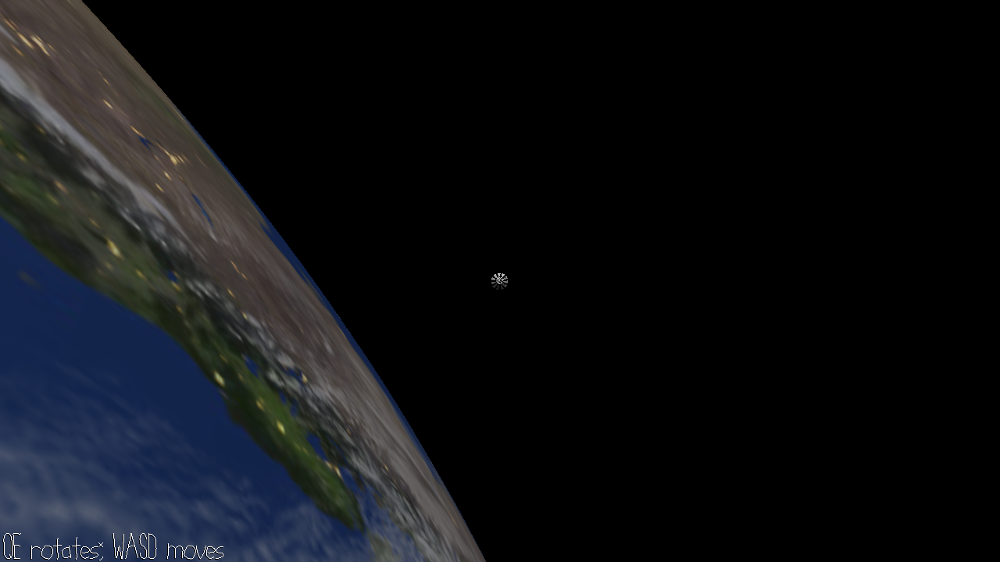

# No Time For Caution

Author: Harrison Chen

Design:

Screen Shot:

How Your Asset Pipeline Works:

(TODO: describe the steps in your asset pipeline, from source files to tiles/backgrounds/whatever you upload to the PPU466.)

How To Play:

(TODO: describe the controls and (if needed) goals/strategy.)

Sources: 
- Earth-related realistic textures come from [Solar Textures](https://www.solarsystemscope.com/textures/) under [CC BY 4.0](https://creativecommons.org/licenses/by/4.0/), based on NASA elevation and imagery data [in public domain](https://www.nasa.gov/multimedia/guidelines/index.html).
- The space station model is adapted from
  - [Low poly space scene](https://www.blendswap.com/blend/19262) authored by [artturi](https://www.blendswap.com/profile/341146) under [CC-BY](https://creativecommons.org/licenses/by/4.0/) license
  - [Modular Industrial Pipes 01](https://polyhaven.com/a/modular_industrial_pipes_01) authored by [Jorge Carmaco](https://www.artstation.com/jorgeandrespinedac) under [CC0](https://creativecommons.org/publicdomain/zero/1.0/) license, which is effectively in public domain
- Thanks to [Christopher Fraser](https://www.youtube.com/channel/UCRlED3y4PPk8jxnvQ1pb1ZQ) for the inspiration of [realistic Earth rendering in Blender](https://christopherfraser.gumroad.com/l/planetshader), but neither code nor data from his work is used.

This game was built with [NEST](NEST.md).

